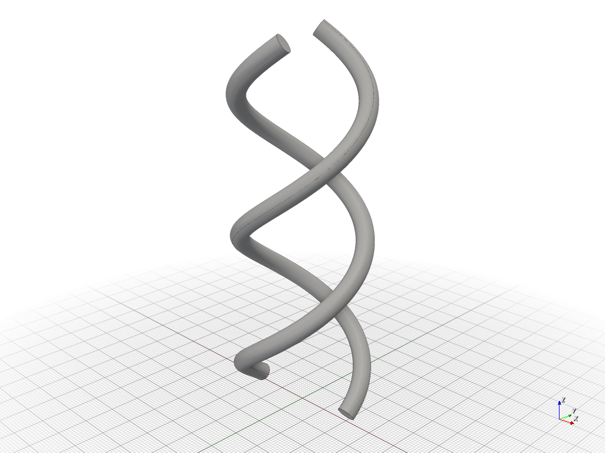
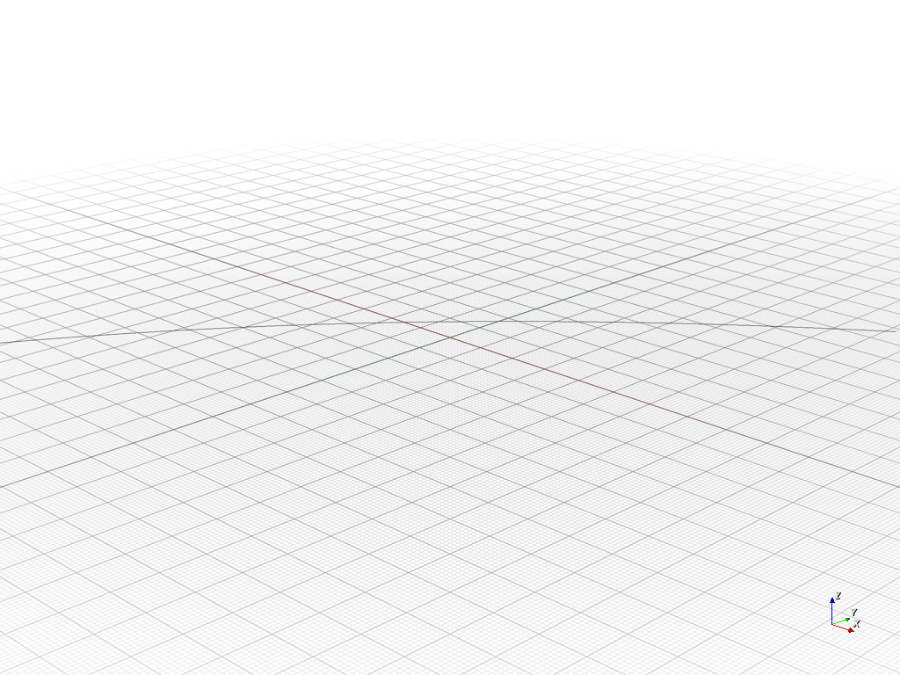
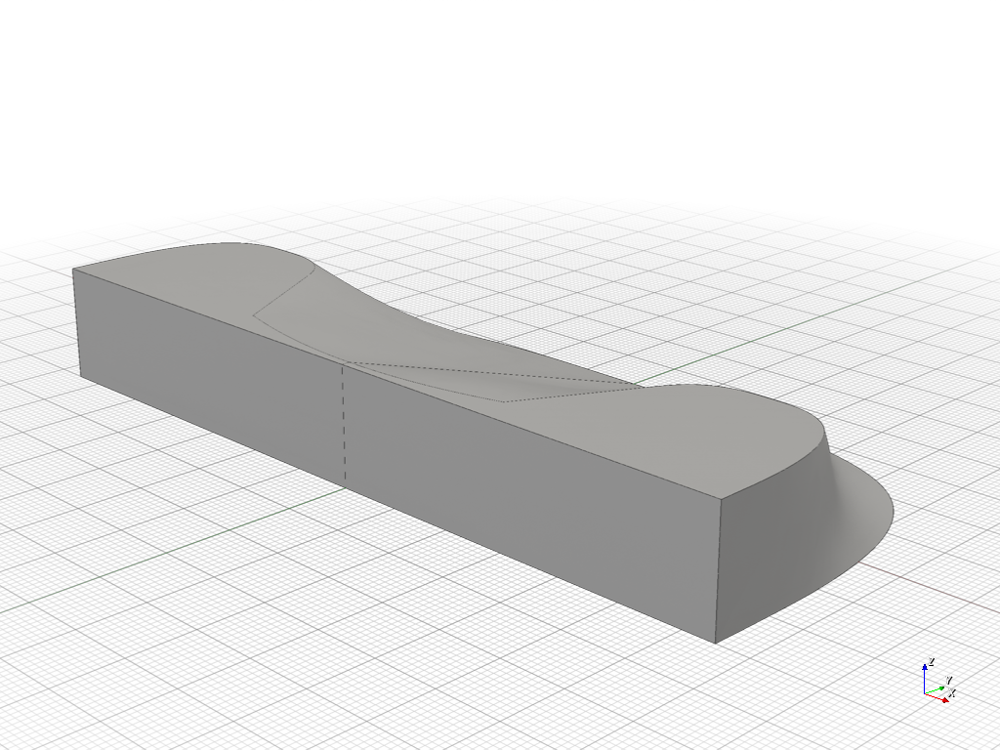
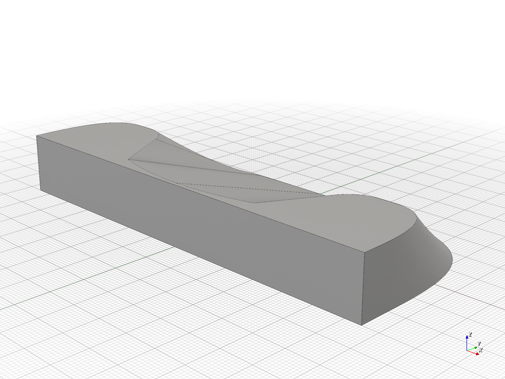

# Samples of build123d discord channel

see also: [#build123d discord channel](https://discord.com/channels/964330484911972403/1074840524181217452)

## many-convex-polyhedrons.py

see also: https://discord.com/channels/964330484911972403/1074840524181217452/1477331703130361999

## dna-like-helix.py

see also: https://discord.com/channels/964330484911972403/1074840524181217452/1475574724477063480

## curved-dovetail-joints.py

see also: https://discord.com/channels/964330484911972403/1074840524181217452/1476676341171490878

## make-surface.py

see also: https://discord.com/channels/964330484911972403/1074840524181217452/1478606694186750065

> I used a basic patch for the "hard part" and a ruled surface just out of laziness for the easy flat bottom.

## loft-split-edges.py

see also: https://discord.com/channels/964330484911972403/1074840524181217452/1478819723217994030

> Matching edge counts allows the loft to succeed here.

